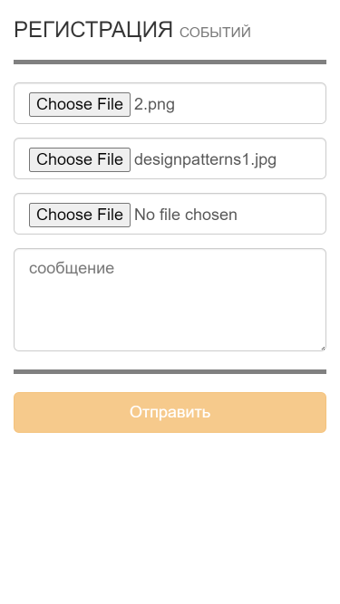

### Image to 1C (AngularJS, Bootstrap3, PHP, 1C)
Web app for upload photo and description from mobile devices to 1C with check of geolocation and suggests nearest projects and place event info into appropriate project.\
PHP uses SOAP for communication with 1C Web Services.\
(1C:Enterprise is the rapid business application development platform with a line of fully customizable accounting, business and CRM applications)

### Image to 1C (AngularJS, Bootstrap3, PHP, 1C)
Веб приложение для загрузки фото и описания с мобильных устройств в 1с, с проверкой геолокации и предложением списка близлежащих проектов.\
PHP использует расширение SOAP для взаимодействия с 1C Web Services.

## Screenshots

<kbd></img></kbd>
