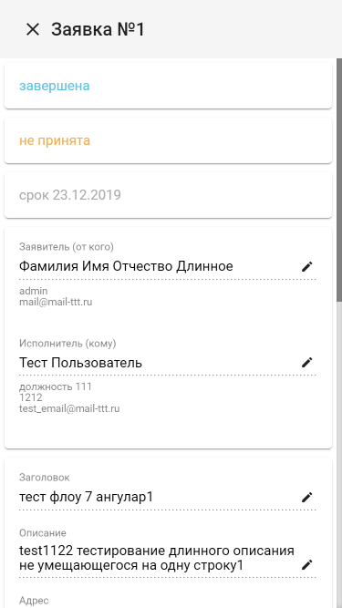

## Code samples

### [Request management (Angular9, Angular Material, PHP(Yii2), MySQL)](./request-management)
Web app optimized for mobile to work with requests in organisation. Search, discussion, status tracking, access rights to request.

### [Image to 1C (AngularJS, Bootstrap3, PHP, 1C)](./image-to-1c)
Web app for upload photo and description from mobile devices to 1C with check of geolocation and suggests nearest projects and place event info into appropriate project.\
PHP uses SOAP for communication with 1C Web Services.\
(1C:Enterprise is the rapid business application development platform with a line of fully customizable accounting, business and CRM applications)

### [Stamp to pdf (Go)](./stamp-to-pdf)
Console utility for place stamp(image) in pdf file.\

## Примеры кода

### [Request management (Angular9, Angular Material, PHP(Yii2), MySQL)](./request-management)
Веб приложение оптимизированное под мобильные устройства для работы с внутрикорпоративными заявками (заявки представляют из себя запросы в свободной форме на любые работы внутри организации). Включает в себя возможности поиска, обсуждение, отслеживание состояния, ограничение видимости.

### [Image to 1C (AngularJS, Bootstrap3, PHP, 1C)](./image-to-1c)
Веб приложение для загрузки фото и описания с мобильных устройств в 1с, с проверкой геолокации и предложением списка близлежащих проектов.\
PHP использует расширение SOAP для взаимодействия с 1C Web Services.

### [Stamp to pdf (Go)](./stamp-to-pdf)
Консольная утилита для вставки штампа(изображения) в pdf.\

## Screenshots

<kbd></img></kbd>
<kbd></img></kbd>
<kbd></img></kbd>
<kbd></img></kbd>
<kbd></img></kbd>
