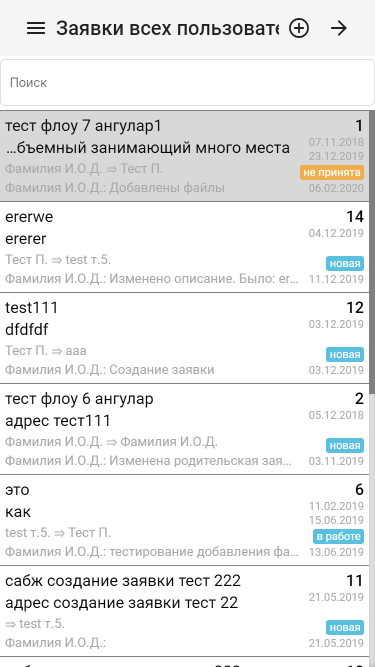
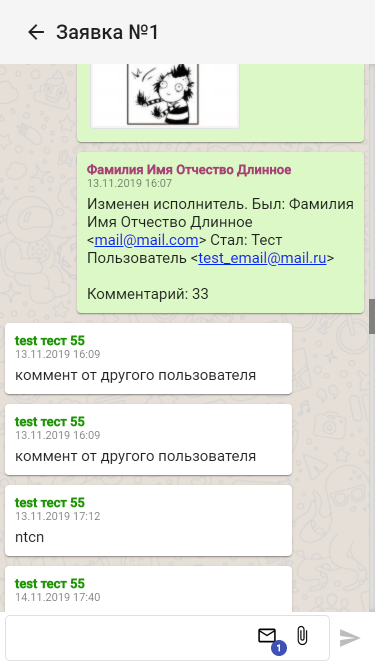
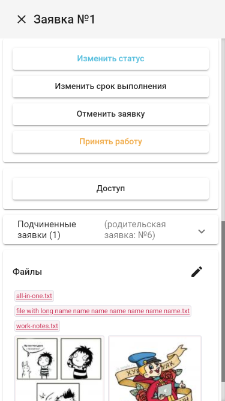
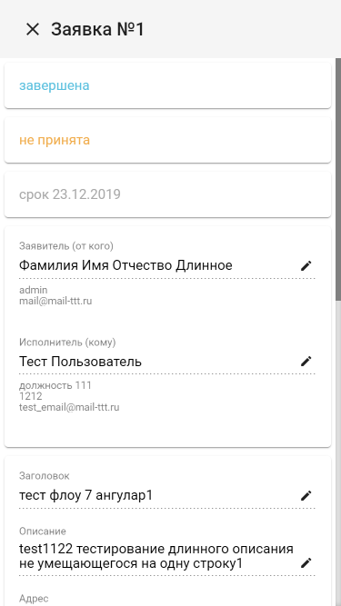

### Request management (Angular9, Angular Material, PHP(Yii2), MySQL)
Web app optimized for mobile to work with requests in organisation. Search, discussion, status tracking, access rights to request.

### Request management (Angular9, Angular Material, PHP(Yii2), MySQL)
Веб приложение оптимизированное под мобильные устройства для работы с внутрикорпоративными заявками (заявки представляют из себя запросы в свободной форме на любые работы внутри организации). Включает в себя возможности поиска, обсуждение, отслеживание состояния, ограничение видимости.

## Screenshots

<kbd></img></kbd>
<kbd></img></kbd>
<kbd></img></kbd>
<kbd></img></kbd>
